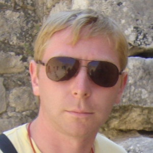

## Kvaratskheliya Bagrat


# Contacts:
- email: k.bagrat@gmail.com
- discord: Bagrat#9909

# Target:
Website development of a good level.
I consider perseverance to be my strength. Now I work as a design engineer. 
After graduation, I plan to change jobs. 
I have knowledge from articles on the Internet on topics:
* _JS_
* _HTML_
* _CSS_
* _Git_

Sample code from Codewars:
```sh
	function towerBuilder(nFloors) {
		let numberOfSigns = nFloors + (nFloors - 1);
		let arr = [];
		for (let i = 1, j = 1; j <= nFloors; i = i + 2, j++) {
			let space = (numberOfSigns - i) / 2;
			let str = " ".repeat(space) + "*".repeat(i) + " ".repeat(space);
			arr.push(str);
		}
		return arr;
	}
```

# Education:
Higher technical "VOENMEH"

# Languages:
* Russian - native
* English - not native


[Example of completed work](https://KBagrat.github.io/rsschool-cv/cv "Example of completed work_")